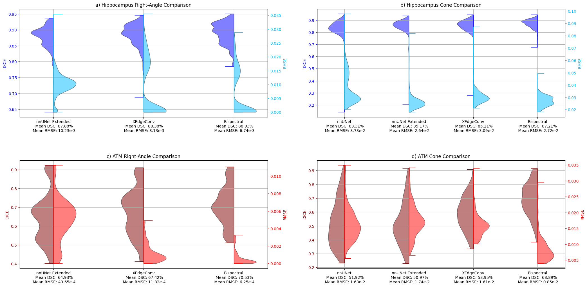

Code for 3D bispectral nnUNet segmentation presented in _A Bispectral 3D U-Net for Rotation Robustness in Medical Segmentation_. 
The data must be processed according to the nnUNet pipeline. The train/tests splits are available for both datasets but must be copied to the processed folder.

WHen comparing the graphs, a typo can be seen in the paper as the bispectral UNet is slightly better than reported.

It builds on top of [nnUNet code](https://github.com/MIC-DKFZ/nnUNet). Note that the code was not created with nnUNet v2 and is probably not compatible but all files needed to reproduce the bispectral models are in "models/layers" and must be copied here:  
  - bispectral_unet.py in nnUNet/nnunet/network_architecture/custom_modules
  - bispectral_layer.py in nnUNet/nnunet/network_architecture/custom_modules

The files in "models/nnUNet_specific" folder must be included in the base code as follow:
  - predict_simple_compare.py in nnUNet/nnunet/inference
  - data_augmentation_moreDA.py in nnUNet/nnunet/training/data_augmentation 
  - nnUNetTrainerV2_Bispectrum.py in nnUNet/nnunet/training/network_training/nnUNet_variants/architectural_variants
  - nnUNetTrainerV2.py in nnUNet/nnunet/training/network_training
  - nnUNetTrainerV2_Bispectrum_newsplits.py in nnUNet/nnunet/training/network_training/nnUNet_variants

The necessary package are available in anaconda environment.yml file
